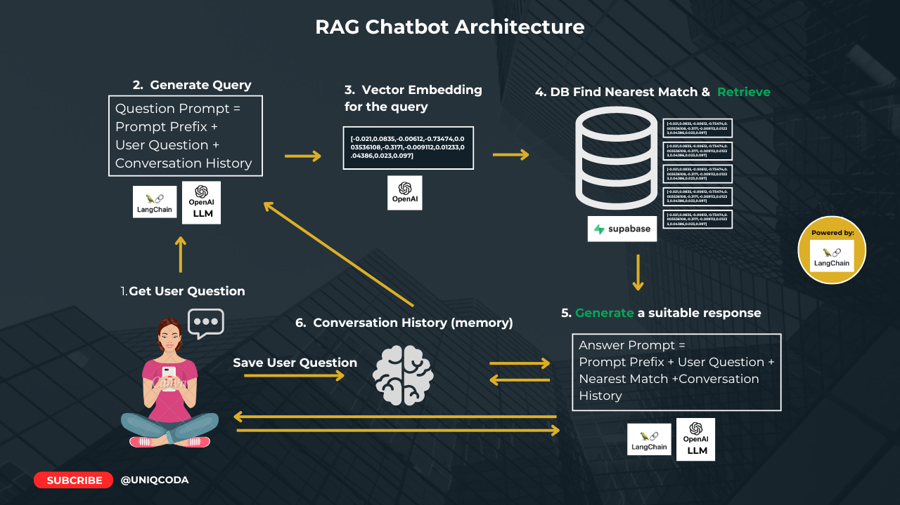

# RAG Chatbot

This is an LLM Chatbot powered by RAG. The tech stack includes Javascript, Langchain, OpenAI and Supabase vector store.

LLM - Large Language Model  
RAG - Retrieval Augumented Generation  

For a video walkthrough, [click this YouTube link to watch]().



1. Intall dependencies
```bash
yarn
```

2. Initialize your Supabase database by following the instructions in the [docs](https://supabase.com/docs/guides/ai/langchain#initializing-your-database)

3. Get [OpenAI API key](https://platform.openai.com/account/api-keys)

4. Split document and save to Supabase Vector database (Run once or only when you need to store a document)
```bash
node utils/splitDocument.js
```


### More Docs and Links
Vite JS [Docs](https://vitejs.dev/guide/#scaffolding-your-first-vite-project)  
Langchain JS [Docs](https://js.langchain.com/docs/get_started/introduction)  
Langchain JS [Chat Bot Docs](https://js.langchain.com/docs/modules/chains/popular/chat_vector_db#built-in-memory)  
Langchain JS [Text Splitter Docs](https://js.langchain.com/docs/modules/data_connection/document_transformers/#get-started-with-text-splitters)  